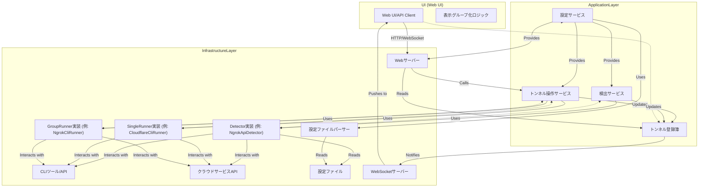

# トンネル管理アプリケーション：最終版ドキュメント

---

## 1. 要件定義書

### 1.1 目的

本アプリケーションは、ローカル環境で動作する複数のトンネルサービス（例: ngrok, Cloudflare Tunnel）の統合管理をWeb UIを通じて提供します。ユーザーは、様々なソースから検出されたトンネル定義を一覧で確認し、個別にまたは一括でトンネルを起動・停止できることを目的とします。これにより、煩雑なCLI操作を簡素化し、開発者の生産性向上に貢献します。

### 1.2 背景

今日のWeb開発において、ローカル開発環境を外部に一時的に公開するニーズは高く、ngrokやCloudflare Tunnelのようなツールが広く利用されています。しかし、これらのツールはそれぞれ独自のコマンド体系や設定を持ち、特に複数のツールを併用する場合、管理が複雑化します。本アプリケーションは、この課題を解決し、統一されたインターフェースでトンネル管理を可能にします。

### 1.3 機能要件

* **FN-01: トンネル定義の検出**:
    * アプリケーション起動時および定期的に、設定ファイル（アプリケーション設定、CLIツール設定ファイルなど）やCLIツールのAPIからトンネル定義および稼働中のトンネルを検出する。
    * 検出されたトンネル情報はUI上に一覧表示される。
    * 検出されたトンネル項目は、**`UNKNOWN`**（定義のみ、未稼働）または**`RUNNING`**（検出器により稼働が確認された外部トンネル）のいずれかの状態を持つ。
    * 同一のローカルURLを持つ項目が複数のソースから検出された場合、`RUNNING`状態が`UNKNOWN`状態より優先され、`sourceTypes`には全ての検出元が記録される。
* **FN-02: トンネルの起動**:
    * `UNKNOWN`状態のトンネル定義（検出されたもの）に対し、個別にトンネルを起動できる。
    * 起動に成功した場合、そのトンネルはアプリケーションによって管理される`RUNNING`状態の項目としてUIにリアルタイムで反映される。
* **FN-03: トンネルの停止**:
    * アプリケーションによって起動され管理されている`RUNNING`状態のトンネルに対し、個別にトンネルを停止できる。
    * 停止コマンドの実行に成功した場合、そのトンネルはアプリケーションの管理下から外れ、UIから消える。**`STOPPED`という状態はUIには表示しない。**
    * これは `SingleRunner` の具体によって行われる。
* **FN-04: トンネルの一括操作 (オプション)**:
    * 複数のトンネルを一括で起動・停止できる。
    * これは `GroupRunner` の具体によって行われる。
* **FN-05: トンネル状態のリアルタイム表示**:
    * 各トンネルの現在の状態（`RUNNING`, `UNKNOWN`）がUIにリアルタイムで表示される。
    * 公開URL、プロトコル、サブドメイン、ホスト名、リージョンなどの詳細情報も表示される。
* **FN-06: 複数情報源の統合と表示**:
    * `DetectorService`による検出結果と`TunnelOperationService`による管理下トンネル情報を統合し、単一の一貫したトンネルリストとしてUIに提供する。
    * UIは、同じローカルURLを持つ複数のトンネルを**グループ化**して表示する。
    * 各トンネル項目がどの`Detector`(または `Runner` )から検出されたか（`sourceTypes`）をUIで確認できる。
* **FN-07: アプリケーション設定の外部化**:
    * アプリケーションの各種設定（Detector/Runnerごとの設定、Webサーバーポートなど）を外部ファイル（例: YAML/JSON）から読み込めること。
    * CLI引数により設定ファイルのパスを指定できること。
    * 設定ファイルの構造は、JSONスキーマで定義・公開されること。

### 1.4 非機能要件

* **NFN-01: パフォーマンス**: トンネルの検出、操作、UI更新は、ユーザーがストレスを感じない程度の速度で行われること。
* **NFN-02: 拡張性**: 新しいCLIツールやトンネルサービスへの対応が容易であること。
* **NFN-03: 信頼性**: CLIツールの異常終了やエラー発生時にも、アプリケーションが安定して動作すること。
* **NFN-04: コード品質**:
    * **緩いクリーンアーキテクチャ**に沿ったモジュール構造とする。
    * 依存性注入は**手動配線のコンストラクタインジェクション**を基本とする。
    * 不必要なインターフェースは作成しない（ただし、プラグイン性や多形性が必須の場合は除く）。
    * データモデルを含む**あらゆるものを基本的に不変 (immutable)** とし、セッターを公開しない。

---

## 2. 設計書 (アーキテクチャ設計)

### 2.1 全体アーキテクチャ

アプリケーションは、Web UI、アプリケーション層、インフラストラクチャ層の3つの主要なレイヤーで構成され、緩いクリーンアーキテクチャの原則に沿って依存方向が内側へ向かうように設計します。



### 2.2 主要コンポーネントと責務

* **Web UI**:
    * ユーザーインターフェースを提供。バックエンドのAPIエンドポイントを通じて操作要求を送信し、WebSocketを通じてリアルタイムな状態更新を受信します。
    * 受信した`TunnelItem`リストを**`localUrl`でグループ化して表示**するロジックを持ちます。
* **`TunnelOperationService`**: (アプリケーション層)
    * UIからのトンネル起動・停止リクエストを受け付ける**ユースケースの中心**。
    * 適切な`Runner`実装（`SingleRunnerImpl`, `GroupRunnerImple`）を呼び出し、実際のCLI操作やAPI実行を指示します。
    * 操作結果を`TunnelRegistry`に伝え、状態を更新させます。
    * **公開エンドポイント**: `POST /api/tunnels/start`, `POST /api/tunnels/stop`。
* **`DetectorService`**: (アプリケーション層)
    * 登録された複数の`Detector`実装（`DetImpl`）を管理し、定期的に検出処理を実行します。
    * 各`Detector`から返された`TunnelItem`のリストを収集し、**`Detector項目リスト`の統合ロジック**（後述）に基づいて`TunnelRegistry`に更新を依頼します。
* **`TunnelRegistry`**: (アプリケーション層)
    * アプリケーションが管理する**全てのトンネル情報の単一のソース**となります。
    * `DetectorService`と`TunnelOperationService`からの更新を受け取り、内部の`detectorItems`リストと`runnerItems`リストを一貫性のある状態で保持します。
    * UIへのリアルタイムな状態変更通知（WebSocketなど）を行います。
    * **公開エンドポイント**: `GET /api/tunnels/status` (WebSocketエンドポイント)。
* **`ConfigService`**: (アプリケーション層)
    * 外部設定ファイル（`AppConfig`）を読み込み、パースする責務を持ちます。
    * アプリケーション起動時に、このサービスから設定情報を取得し、各`Detector`や`Runner`の実装を構築・初期化します。
* **`Detector`**: (インフラストラクチャ層のインターフェース)
    * 特定の情報源からトンネル情報を検出する抽象。複数の具体的な実装（例: `NgrokApiDetector`, `WebAppConfigDetector`）がこれに従います。
* **`Runner`**: (インフラストラクチャ層のインターフェース、`SingleRunner`と`GroupRunner`を含む)
    * CLIツールや外部サービスと連携し、トンネルの起動・停止を実際に行う抽象。複数の具体的な実装（例: `NgrokCliRunner`, `CloudflaredCliRunner`）がこれに従います。
* **`ConfigParser`**: (インフラストラクチャ層)
    * 指定されたファイルパスから設定ファイル（YAML/JSON）を読み込み、対応するJavaの`AppConfig`オブジェクトにデシリアライズします。
    * エラーハンドリング（ファイルが見つからない、パースエラーなど）を行います。
* **Webサーバー**: (インフラストラクチャ層)
    * HTTP(S)リクエストを受け付け、適切なアプリケーション層サービスへルーティングします。
    * 静的コンテンツ（Web UI）の配信も行います。
* **WebSocketサーバー**: (インフラストラクチャ層)
    * `TunnelRegistry`からの更新通知をWeb UIクライアントにリアルタイムでプッシュします。

### 2.3 データフロー

1.  **設定ロードフロー**: アプリケーション起動時、`ConfigService`が`ConfigParser`を利用して設定ファイルから`AppConfig`をロードします。この`AppConfig`は、`DetectorService`、`TunnelOperationService`、Webサーバーなどの初期化に利用されます。
2.  **検出フロー**: `DetectorService`が`Detector`実装を呼び出し、検出結果を`TunnelRegistry`に送ります。`TunnelRegistry`は`detectorItems`を更新し、UIに通知します。
3.  **操作フロー**:
    * UIが`TunnelOperationService`のAPIエンドポイントを呼び出す（HTTP）。
    * `TunnelOperationService`が適切な`Runner`実装を呼び出し、CLIコマンド実行などを指示します。
    * `Runner`の実行結果（起動された`TunnelItem`、または停止完了）が`TunnelOperationService`に返ります。
    * `TunnelOperationService`が`TunnelRegistry`の`runnerItems`を更新します。
    * `TunnelRegistry`はUIにリアルタイム通知（WebSocket）を行います。
4.  **表示フロー**: UIは`TunnelRegistry`からの通知を受け取り、`detectorItems`と`runnerItems`をマージした結果を`localUrl`でグループ化して表示します。

---

## 3. 詳細設計書

### 3.1 データモデル: `TunnelItem`

`TunnelItem`はアプリケーション内でトンネルに関する情報を表現する**不変な（immutableな）レコード**とします。

```java
// Java Record の例 (Java 16 以降)
import java.util.List;
import java.util.Optional;
import java.util.UUID; // id 生成に使用
import com.fasterxml.jackson.annotation.JsonCreator; // Jacksonでレコードをデシリアライズする際に必要になる場合がある

public record TunnelItem(
    TunnelId id,                // 項目を一意に識別するUUID。生成時に割り当て、不変。
    String localUrl,          // トンネルの転送元ローカルアドレス (例: "http://localhost:8080")
    Optional<String> publicUrl, // 外部公開URL。稼働中のみ値を持つ。不変。
    Status status,            // トンネルの現在の状態 (RUNNING, UNKNOWN)。不変。
    List<String> sourceTypes, // この項目を検出したDetectorのタイプリスト。不変。
) {
    public enum Status {
        RUNNING,   // 稼働中 (Runnerで管理中、またはDetectorで稼働を確認)
        UNKNOWN    // 状態不明 (定義があるが、稼働しているか停止しているか不明)
    }

    // コンストラクタでUUIDを自動生成するなど、不変性を保証するヘルパーメソッドを提供可能
    // JsonCreatorは、JacksonでJSONからレコードを生成する際に使用される
    @JsonCreator
    public TunnelItem {
        if (id == null || id.isEmpty()) {
            id = UUID.randomUUID().toString();
        }
        // コレクションフィールドの防御的コピー (不変リストの保証)
        sourceTypes = List.copyOf(sourceTypes != null ? sourceTypes : List.of());
    }

    public boolean isRunnable() {
        return status == Status.UNKNOWN; // UNKNOWN 状態のみが起動可能
    }
}
```

### 3.2 アプリケーション設定データモデル

アプリケーションの設定は、`AppConfig`をルートとし、各コンポーネント固有の設定を含むレコードとして定義します。Jacksonライブラリによるデシリアライズを前提とし、ポリモーフィックな設定には`@JsonTypeInfo`と`@JsonSubTypes`を使用します。

```java
import java.util.List;
import com.fasterxml.jackson.annotation.JsonSubTypes;
import com.fasterxml.jackson.annotation.JsonTypeInfo;

// -----------------------------------------------------
// 共通設定インターフェース
// -----------------------------------------------------
public interface DetectorConfig { String getType(); }
public interface RunnerConfig { String getType(); }

// -----------------------------------------------------
// Detector 関連設定
// -----------------------------------------------------
public record WebAppConfigDetectorConfig(
    String type, // "web-app-config"
    String configFilePath // Webアプリの設定ファイルのパス
) implements DetectorConfig {}

public record NgrokApiDetectorConfig(
    String type, // "ngrok-api"
    String ngrokApiUrl // ngrokローカルAPIのURL (通常は http://localhost:4040)
) implements DetectorConfig {}

// -----------------------------------------------------
// Runner 関連設定
// -----------------------------------------------------
public record NgrokCliRunnerConfig(
    String type, // "ngrok-cli"
    String ngrokCliPath,   // ngrok実行ファイルのパス
    String authToken       // ngrok認証トークン (Optional)
) implements RunnerConfig {}

public record CloudflaredCliRunnerConfig(
    String type, // "cloudflared-cli"
    String cloudflaredCliPath, // cloudflared実行ファイルのパス
    String credentialFilePath  // Cloudflare認証情報のパス
) implements RunnerConfig {}

// -----------------------------------------------------
// Webサーバー設定
// -----------------------------------------------------
public record WebServerConfig(
    int port,
    boolean enableHttps
) {}

// -----------------------------------------------------
// アプリケーション全体の設定 (AppConfig)
// -----------------------------------------------------
public record AppConfig(
    @JsonTypeInfo(
        use = JsonTypeInfo.Id.NAME,
        include = JsonTypeInfo.As.PROPERTY,
        property = "type"
    )
    @JsonSubTypes({
        @JsonSubTypes.Type(value = WebAppConfigDetectorConfig.class, name = "web-app-config"),
        @JsonSubTypes.Type(value = NgrokApiDetectorConfig.class, name = "ngrok-api")
        // 他のDetectorConfig実装があれば追加
    })
    List<DetectorConfig> detectors,

    @JsonTypeInfo(
        use = JsonTypeInfo.Id.NAME,
        include = JsonTypeInfo.As.PROPERTY,
        property = "type"
    )
    @JsonSubTypes({
        @JsonSubTypes.Type(value = NgrokCliRunnerConfig.class, name = "ngrok-cli"),
        @JsonSubTypes.Type(value = CloudflaredCliRunnerConfig.class, name = "cloudflared-cli")
        // 他のRunnerConfig実装があれば追加
    })
    List<RunnerConfig> runners,

    WebServerConfig webServer
) {}
```

### 3.3 インターフェース定義

##### `Detector` インターフェース (インフラストラクチャ層)

```java
import java.util.List;

public interface Detector {
    String getType(); // このDetectorのタイプ識別子 (例: "ngrok-api", "web-app-config")
    List<TunnelItem> detect(); // トンネルを検出し、TunnelItemのリストとして返す
}
```

##### `Runner` インターフェース (インフラストラクチャ層)

```java
import java.util.List;
import java.util.Optional;

public interface Runner {
    String getType(); // このRunnerのタイプ識別子 (例: "ngrok-cli", "cloudflared-cli")
    
    // 単一トンネルの起動 (localUrlとオプションを受け取り、起動されたTunnelItemを返す)
    List<TunnelItem> start(TunnelItem tunnel);

    // 指定されたIDのトンネルを停止する
    // 停止に成功すればtrue、対象なしや失敗はfalseまたは例外をスロー
    boolean stop(TunnelId tunnelId); 
    
    // このRunnerが現在管理するトンネルのステータスを取得 (RunnerManagerが内部的に利用)
    // 主にUI表示されるrunnerItemsリストのソースとなる
    List<TunnelItem> getStatus(); 
}
```

### 3.4 アプリケーション層の主要サービス詳細

##### `TunnelRegistry` (アプリケーション層)

アプリケーション内のトンネル情報の単一ソース。

* **内部状態**:
    * `private List<TunnelItem> detectorItems;` (不変リストとして扱う)
    * `private List<TunnelItem> runnerItems;` (不変リストとして扱う)
    * `private final List<Consumer<List<TunnelItem>>> listeners;` (状態変更リスナー)
* **コンストラクタ**: DIにより依存関係を受け取る。
* **メソッド**:
    * `updateDetectorItems(List<TunnelItem> newDetectedItems)`:
        * 受け取った `newDetectedItems` を既存の `detectorItems` とマージする。
        * **マージロジック**:
            1.  `newDetectedItems` と現在の `detectorItems` の両方から、`localUrl` をキーとするマップを作成する。
            2.  `localUrl` が重複する項目については、`RUNNING` ステータスの項目が `UNKNOWN` ステータスの項目より優先される。
            3.  `sourceTypes` リストは、マージ元の全ての `sourceType` を結合し、重複を排除して保持する。
            4.  `TunnelItem` のオプション情報 (subdomain, hostnameなど) は、優先された項目から採用する。もし優先される項目に値がなく、優先されない項目に値があれば、その値を補完する。
            5.  最終的にマージされた `TunnelItem` リストで `this.detectorItems` を更新する（新しい不変リストを作成し置き換える）。
        * `notifyListeners()` を呼び出す。
    * `addRunnerItem(TunnelItem item)`:
        * `this.runnerItems` に `item` を追加する（新しい不変リストを作成し置き換える）。
        * `notifyListeners()` を呼び出す。
    * `removeRunnerItem(String tunnelId)`:
        * `this.runnerItems` から `tunnelId` に一致する項目を削除する（新しい不変リストを作成し置き換える）。
        * `notifyListeners()` を呼び出す。
    * `getMergedTunnelItems()`:
        * UIに提供するための最終的なマージ済みリストを生成する。
        * **マージロジック**:
            1.  `List<TunnelItem> finalDisplayList = new ArrayList<>();`
            2.  `Set<String> processedLocalUrls = new HashSet<>();`
            3.  **`runnerItems` を最優先で追加**: 各 `runnerItem` を `finalDisplayList` に追加し、`runnerItem.localUrl()` を `processedLocalUrls` に追加する。
            4.  **`detectorItems` を追加**: 各 `detectorItem` をループし、`processedLocalUrls.contains(detectorItem.localUrl())` でない場合のみ `finalDisplayList` に追加し、`processedLocalUrls` に追加する。
            5.  `finalDisplayList` を返す。
    * `addChangeListener(Consumer<List<TunnelItem>> listener)`: UIが状態変更を購読するためのメソッド。
    * `private void notifyListeners()`: 登録されたリスナーに `getMergedTunnelItems()` の結果を通知する。

##### `DetectorService` (アプリケーション層)

検出ロジックを統括。

* **内部状態**:
    * `private final List<Detector> detectors;` (DIで注入されるDetector実装リスト)
    * `private final TunnelRegistry tunnelRegistry;` (DIで注入される)
    * `private final ScheduledExecutorService scheduler;` (DIで注入される、検出スケジューリング用)
* **コンストラクタ**: DIにより`Detector`リストと`TunnelRegistry`を受け取る。
* **メソッド**:
    * `startDetection()`: 定期的な検出処理をスケジュールする。
    * `performDetection()`:
        * 全ての `Detector` をループし、`detect()` を呼び出す。
        * 各 `Detector` が返す `TunnelItem` リストを結合する。
        * `tunnelRegistry.updateDetectorItems()` を呼び出し、結合したリストを渡す。

##### `TunnelOperationService` (アプリケーション層)

起動・停止ロジックを統括。UI APIエンドポイントからの呼び出しを受け付ける。

* **内部状態**:
    * `private final List<Runner> runners;` (DIで注入されるRunner実装リスト)
    * `private final TunnelRegistry tunnelRegistry;` (DIで注入される)
* **コンストラクタ**: DIにより`Runner`リストと`TunnelRegistry`を受け取る。
* **メソッド**:
    * `startTunnel(String localUrl, Optional<String> subdomain, ...)`:
        * 指定された`localUrl`とオプションに基づいて、適切な`Runner`を選択（例: `localUrl`のプロトコルやオプションから判断）。
        * 選択した`Runner.start()`を呼び出す。
        * 起動が成功した場合、`tunnelRegistry.addRunnerItem()`を呼び出す。
        * 起動に失敗した場合は、適切なエラー処理（ログ出力、UIへのエラーメッセージ通知など）。
    * `stopTunnel(String tunnelId)`:
        * `tunnelId`に基づいて、そのトンネルを管理している`Runner`を特定する。
        * 特定した`Runner.stop()`を呼び出す。
        * 停止が成功した場合、`tunnelRegistry.removeRunnerItem()`を呼び出す。
        * 停止に失敗した場合は、適切なエラー処理。

##### `ConfigService` (アプリケーション層)

アプリケーションの設定を管理するサービス。

* **内部状態**:
    * `private final AppConfig appConfig;` (ロードされた設定オブジェクト。不変。)
* **コンストラクタ**:
    * `public ConfigService(String configFilePath, ConfigParser parser)`: CLI引数で指定された設定ファイルパスと、設定をパースする`ConfigParser`を受け取る。
    * コンストラクタ内で`parser.parse(configFilePath)`を呼び出し、`this.appConfig`を初期化する。ファイルが見つからない、パースエラーの場合はデフォルト設定をロードするか、例外をスローする。
* **メソッド**:
    * `getAppConfig()`: ロードされた`AppConfig`オブジェクトを返す。
    * `getDetectorConfigs()`: `appConfig.detectors()`を返す。
    * `getRunnerConfigs()`: `appConfig.runners()`を返す。
    * `getWebServerConfig()`: `appConfig.webServer()`を返す。

#### 3.5 依存性注入 (DI) の方針

* 全てのサービス、マネージャー、およびその依存関係は、**コンストラクタインジェクション**を用いて手動で配線される。
* アプリケーションの起動時（`main`メソッドなど）に、`ConfigService`を使用して`AppConfig`をロードし、その情報に基づいて`Detector`や`Runner`の具体的なインスタンスを生成する。
* 生成されたインスタンスは、`DetectorService`、`TunnelOperationService`、`TunnelRegistry`といったアプリケーション層のサービスに注入される。
* **DIコンテナは使用せず**、全ての依存関係は明示的にコードで構築される。

#### 3.6 不変性 (Immutability) の徹底

* `TunnelItem`および`AppConfig`、各種`Config`レコードはJava Recordとして定義され、全てのフィールドが不変である。
* `TunnelRegistry`やその他のサービスが内部で管理するリスト（`detectorItems`, `runnerItems`など）は、要素の追加・削除・更新が必要な場合でも、**常に新しいリストインスタンスを生成して置き換える**ことで不変性を保証する。これにより、並行処理時の競合条件のリスクを最小限に抑える。
* セッターは公開せず、状態変更は、新しいインスタンスを返すか、特定のメソッドを通じて明示的に行う。

#### 3.7 設定ファイルのロードとJSONスキーマ

##### 3.7.1 `ConfigParser` (インフラストラクチャ層)

* `ConfigParser`は、Jackson Databindライブラリなどを利用し、ファイルから`AppConfig`オブジェクトへのデシリアライズを担う。
* ポリモーフィックな`DetectorConfig`や`RunnerConfig`のパースには、`@JsonTypeInfo`と`@JsonSubTypes`アノテーションが適切に設定された`AppConfig`レコード定義を使用する。

##### 3.7.2 CLI引数による設定ファイル指定

* アプリケーションの`main`メソッドで、`String[] args`から`--config <path>`のようなCLI引数を解析する。
* 引数でパスが指定された場合、そのパスのファイルを`ConfigService`に渡す。
* 引数が指定されない場合、デフォルトのパス（例: `conf/application.yaml`）またはクラスパス内のリソース（例: `/application.yaml`）を`ConfigService`に渡す。

##### 3.7.3 JSONスキーマの提供

* `AppConfig`のJavaレコード定義に基づき、JSONスキーマを手動で作成するか、`jsonschema-generator`のようなツールを用いて自動生成する。
* 生成されたJSONスキーマファイルは、アプリケーションのドキュメントとして提供され、ユーザーが設定ファイルを作成する際のガイドラインとする。これにより、設定のバリデーションやIDEの支援が可能となる。

---

## 4. UI設計 (モックアップを含む)

### 4.1 UIの全体構成

Web UIは、主に以下の要素で構成されます。

* **ヘッダー**: アプリケーション名、全体的な設定へのリンクなど。
* **メインコンテンツ領域**:
    * **トンネル一覧表示エリア**: 検出されたトンネルおよび稼働中のトンネルを一覧表示します。
    * **アクションボタン**: 全体の一括操作（一括起動/停止など、オプション）や、アプリケーション設定へのアクセス。
* **フッター**: ログやステータスバー（オプション）。

### 4.2 トンネル一覧表示エリアのレイアウトと要素

トンネル一覧表示エリアは、`localUrl`をキーとしてトンネルをグループ化し、各グループ内に詳細な情報を表示するデザインとします。

#### グループ化された表示例

```
- ローカルURL: http://localhost:8080 [ngrok 起動] [cloudflare 起動]
  (srcTags: "web-config", "ngrok-cli")
  - Ngrok (RUNNING): [https://abc.ngrok.io](https://abc.ngrok.io) [停止] [詳細]
- ローカルURL: http://localhost:3000 [ngrok 起動] [cloudflare 起動]
  (srcTags: "web-config")
- ローカルURL: http://localhost:5000 [ngrok 起動] [cloudflare 起動]
  (srcTags: "ngrok-api", "cloudflare-cli")
  - Ngrok (RUNNING): [https://abc.ngrok.io](https://abc.ngrok.io) [停止] [詳細]
  - Cloudflare (RUNNING): [https://abc.cloudflare.com](https://abc.cloudflare.com) [停止] [詳細]
```

#### 各要素の詳細

* **グループヘッダー**:
    * `localUrl`: グループの識別子となるローカルURL。
    * **グループアクションボタン (オプション)**: その`localUrl`に関連する全ての稼働中トンネルを停止するボタン、または新しいトンネルを起動するボタンなど。
* **トンネル項目 (子要素)**:
    * **`sourceType`**: トンネルの検出元または管理元を示すアイコン/テキスト（例: `Ngrok`, `Cloudflare`, `WebApp Config`）。`sourceTypes`リストの要素を全て表示するか、主要なものを表示するかはUIの判断。
    * **`status`**: `RUNNING` または `UNKNOWN`。色分けなどで視覚的に区別。
    * **`publicUrl`**: 稼働中の場合のみ表示。クリック可能にしてブラウザで開けるようにする。`UNKNOWN`の場合は`(未公開)`などと表示。
    * **操作ボタン**:
        * **`UNKNOWN`状態の項目**: `[起動]` ボタン。クリックで`TunnelOperationService.start()`を呼び出す。
        * **`RUNNING`状態の項目**: `[停止]` ボタン。クリックで`TunnelOperationService.stop()`を呼び出す。
    * **`[詳細]` ボタン (オプション)**: クリックでモーダルダイアログなどを開き、`TunnelItem`の全てのフィールド（`id`, `subdomain`, `hostname`, `protocol`, `region`, `sourceTypes`リスト全体など）を表示。
